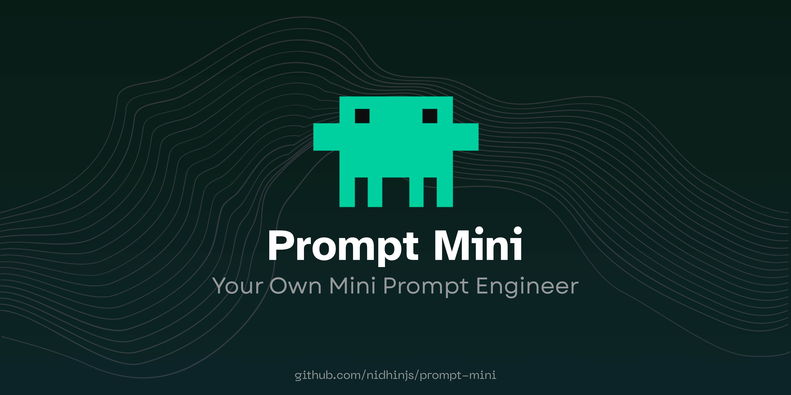
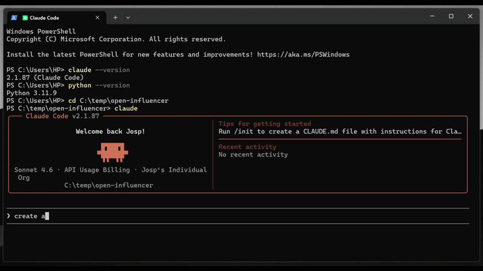

<br/>

A Claude Code plugin agent that intercepts vague prompts before execution. Detects your stack, asks targeted questions, and forges a structured prompt for Claude Code. No re-prompts. Zero wasted credits.

**Works for every major stack:** Next.js, React Native, Expo, Supabase, Prisma, FastAPI, Chrome MV3, Tailwind, shadcn, Clerk, Vercel AI SDK, LangChain, Drizzle, Cloudflare Workers, and 30+ more. Each stack has its own pitfall rules, scope anchors, and stop conditions baked in - so the forged prompt is never generic and common.

---
## 🚨 Demo 

<br/>

---
## 🔗 By the Same Creator

| Tool | What it does | Stars |
|------|-------------|-------|
| [prompt-master](https://github.com/nidhinjs/prompt-master) | A **free** Claude.ai skill that writes the accurate prompts for ANY AI tool.  | 4,000+ ⭐ |

---

## 🚀 Installation

**Requirements:** Claude Code v2.0+ · Python 3.8+


### #1 - Marketplace (Recommended)

**Step 1 - Add the marketplace via terminal**
```
claude plugin marketplace add nidhinjs/prompt-mini
```

**Step 2 - Install via terminal**
```
claude plugin install prompt-mini@nidhinjs-marketplace
```

**Step 3 - Run this script**

Mac / Linux:
```bash
python3 ~/.claude/plugins/cache/nidhinjs-marketplace/prompt-mini/0.1.0/setup.py
```

Windows:
```powershell
python "$env:USERPROFILE\.claude\plugins\cache\nidhinjs-marketplace\prompt-mini\0.1.0\setup.py"
```

**Step 4 - Restart Claude Code**

In Claude Code → Verify with `/prompt-mini` → you should see `prompt-mini` listed.

> Running the script is required due to a [known Claude Code bug](https://github.com/anthropics/claude-code/issues/10225) where plugin hooks don't register automatically.

---

### #2 - Local Install (Contributors)

**Step 1 - Clone**
```bash
git clone https://github.com/nidhinjs/prompt-mini.git
```

**Step 2 - Create a parent folder**

Mac / Linux:
```bash
cd ..
mkdir prompt-mini-dev && cd prompt-mini-dev
mkdir .claude-plugin
echo '{"name":"local-dev","owner":{"name":"nidhinjs"},"plugins":[{"name":"prompt-mini","source":"./prompt-mini"}]}' > .claude-plugin/marketplace.json
mv ../prompt-mini ./prompt-mini
```

Windows:
```powershell
cd ..
mkdir prompt-mini-dev; cd prompt-mini-dev; mkdir .claude-plugin
[System.IO.File]::WriteAllText(".claude-plugin\marketplace.json", '{"name":"local-dev","owner":{"name":"nidhinjs"},"plugins":[{"name":"prompt-mini","source":"./prompt-mini"}]}')
mv ..\prompt-mini .\prompt-mini
```

**Step 3 - Register and install**
```
claude plugin marketplace add /absolute/path/to/prompt-mini-dev
claude plugin install prompt-mini@local-dev
```

**Step 4 - Run setup**
```bash
python prompt-mini/setup.py
```

**Step 5 - Restart Claude Code**

<br/>


## 🎯 How It Works

Every prompt you type gets evaluated by a lightweight Python hook:

**Clear prompt?** → Passes through instantly. Zero questions.

**Vague or framework-specific prompt?** → Hook intercepts. Skill fires. Asks 2-6 targeted questions. Assembles a structured prompt and executes it. 

```
You type a prompt
       ↓
Hook evaluates (~189 tokens)
       ↓
     Clear? ──────────────────→ Pass through instantly
       │
     Vague?
       ↓
Scans project files (package.json, CLAUDE.md, imports)
Detects your stack automatically
Asks ≤5 clarifying questions
Assembles structured 6-block forged prompt
       ↓
Claude Code executes the forged prompt
```

## ⌨️ Bypass

Add `*` at the start of any prompt to skip prompt-mini entirely:

```
* fix the login bug
```

Other auto-bypasses: `/slash-commands` and `#memory-commands` pass through unchanged.

<br/>

---


## 🛠️ Supported Stacks

Framework specific routing, scope anchors, and stop conditions for every major stack.

<details>
<summary><h3>Web Frameworks (11)</h3></summary>

| Stack | What prompt-mini prevents |
|-------|--------------------------|
| **Next.js App Router** | Adds `"use client"` everywhere, mixes App/Pages Router, forgets `"use server"` on actions |
| **Next.js Pages Router** | Uses server actions (App Router only), wrong data fetching pattern |
| **Remix** | Confuses loaders with server actions, misses nested routing |
| **SvelteKit** | Writes React patterns in Svelte files, wrong file conventions |
| **Astro** | Adds React hooks to .astro files, treats it like a SPA |
| **Vite + React** | Attempts server actions, forgets all fetching is client-side |
| **Vite + Vue 3** | Mixes Options API and Composition API |
| **Nuxt 3** | Mixes Nuxt 2 patterns, wrong composables structure |
| **Qwik City** | Treats it like React, misses resumability patterns |
| **T3 Stack** | Creates REST routes instead of tRPC procedures, misses root router |
| **Astro** | Adds hooks to .astro files, forgets island component boundaries |

</details>

<details>
<summary><h3>Mobile (5)</h3></summary>

| Stack | What prompt-mini prevents |
|-------|--------------------------|
| **React Native + Expo** | Uses DOM APIs, imports CSS, forgets platform file conventions |
| **Flutter** | Generates React patterns in Dart, forgets stateful vs stateless widget |
| **Kotlin + Jetpack Compose** | Mixes View system with Compose, wrong lifecycle handling |
| **Swift + SwiftUI** | Mixes UIKit patterns, wrong property wrappers |
| **Capacitor** | Treats it like a native app, forgets web bridge limitations |

</details>

<details>
<summary><h3>Desktop + Extensions (7)</h3></summary>

| Stack | What prompt-mini prevents |
|-------|--------------------------|
| **Tauri 2** | Mixes Rust and frontend code, forgets to register commands in main.rs |
| **Electron** | Puts Node APIs in renderer, skips IPC bridge |
| **Chrome MV3** | Uses background page (MV2), accesses DOM in service worker |
| **Firefox WebExtension** | Wrong manifest key names, missed permission declarations |
| **VS Code Extension** | Registers commands without adding to package.json contributes |
| **Raycast Extension** | Wrong API imports, misses required export structure |
| **Wails** | Mixes Go and frontend runtime assumptions |

</details>

<details>
<summary><h3>Backend / API (8)</h3></summary>

| Stack | What prompt-mini prevents |
|-------|--------------------------|
| **FastAPI** | Forgets Pydantic v2 syntax, skips response_model |
| **NestJS** | Creates services without injecting them via module providers |
| **Hono** | Uses Express req/res instead of Hono context |
| **Node + Express** | No error middleware, missing async error handling |
| **Django** | Mixes function-based and class-based view patterns |
| **Flask** | No blueprint structure, missing error handlers |
| **Go + chi** | Wrong middleware chaining, missing context passing |
| **Rust + Axum** | Wrong error types, missing trait implementations |

</details>

<details>
<summary><h3>AI Apps + Agents (6)</h3></summary>

| Stack | What prompt-mini prevents |
|-------|--------------------------|
| **Vercel AI SDK** | Mixes v3 and v4 APIs, exposes API keys client-side |
| **LangChain.js** | Uses deprecated v0.1 patterns in v0.2+ |
| **LangGraph** | Forgets to compile graph, skips state schema definition |
| **Anthropic SDK** | Puts API key client-side, wrong streaming pattern |
| **OpenAI SDK** | Wrong tool_choice format, misses response parsing |
| **Mastra** | Wrong agent configuration, misses tool registration |

</details>

<details>
<summary><h3>Database / ORM + Auth (12)</h3></summary>

| Stack | What prompt-mini prevents |
|-------|--------------------------|
| **Supabase** | Uses client-side auth checks, disables RLS, wrong SSR client |
| **Prisma** | Schema changes without migration, forgets prisma generate |
| **Drizzle** | Mixes v0.28 and v0.29+ APIs |
| **MongoDB** | Wrong aggregation pipeline syntax |
| **Redis / Upstash** | Wrong command syntax for edge runtime |
| **Turso** | Uses Node-only libsql in edge environment |
| **NextAuth v5** | Uses v4 session callbacks, wrong auth() usage |
| **Clerk** | Uses deprecated authMiddleware, forgets ClerkProvider |
| **Supabase Auth** | Client-side session checks, skips middleware refresh |
| **Better-Auth** | Wrong adapter configuration |
| **Lucia** | Outdated session handling pattern |
| **Convex** | Wrong mutation vs query pattern |

</details>

<details>
<summary><h3>UI + Deploy (10)</h3></summary>

| Stack | What prompt-mini prevents |
|-------|--------------------------|
| **Tailwind CSS 4** | Generates tailwind.config.js (v3 pattern, removed in v4) |
| **shadcn/ui** | Generates component code instead of using CLI |
| **Radix UI** | Missing required accessibility props |
| **MUI** | Wrong theme provider nesting |
| **Mantine** | Missing MantineProvider wrapper |
| **Vercel** | Uses Node-only APIs in Edge Runtime |
| **Cloudflare Workers** | Uses Node APIs not available in Workers runtime |
| **Fly.io** | Wrong Dockerfile for the stack |
| **Railway** | Missing start command in package.json |
| **Docker** | Wrong base image for the runtime |

</details>

---

## 7 Credit-Saving Rules Applied to Every Forged Prompt

| Rule | What it does |
|------|-------------|
| **Constraints in first 30%** | Critical MUST NOT rules go at the top — they decay at the tail and get ignored under execution pressure |
| **Real file paths only** | Scope says `src/lib/auth.ts` not "in the auth module" |
| **Specific stop conditions** | Names exact destructive actions — never "be careful" |
| **One task per prompt** | Two distinct deliverables = Prompt 1 + Prompt 2, never merged |
| **MUST and NEVER over weak words** | "should not" → "MUST NOT". Weak words get ignored. |
| **No ghost features** | Nothing added beyond what was asked. Scope creep burns credits. |
| **Checkpoint on every multi-step task** | `✅ [what was completed]` after each step — catches failures before they compound |

---

## ❓ FAQ

**Does it slow me down?**
Clear prompts: no. The hook is a ~189 token Python check. Vague prompts: 5–15 seconds for the question flow. Faster than re-prompting twice.

**Does it change my prompt without asking?**
No. It asks questions first. You answer. Then the forged prompt goes to Claude Code — you see it before anything executes.

**What if I don't answer all the questions?**
It uses sensible defaults and notes the assumptions in the forged prompt's Context block.

**Does it work for beginners?**
Yes. It detects your experience level from your prompt vocabulary. Beginners get simpler options. Senior devs get fewer questions.

**Can I use it with Cursor / Windsurf?**
Claude Code only for now. Other tools on the roadmap.

<br/>

---

## 📋 Version History

- **0.1.0** — Initial release. Core hook + skill engine. 40+ stacks. 6 prompt templates. 35 credit killing patterns dectected.

<br/>

---

## 📄 License

MIT — see [LICENSE](LICENSE) for details.

